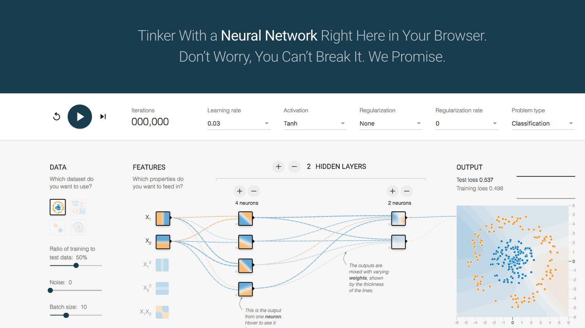

# PBR Training Dataset Generator

A GPU-accelerated pipeline for generating large-scale PBR (Physically Based Rendering) material datasets. It combines **Substance Designer's sbsrender** CLI for procedural texture baking with a custom **OpenGL compute-shader path tracer** to produce photorealistic shaderball renders — ideal for training neural networks on material recognition, estimation, or generation tasks.



## Features

- **Automated material generation** — Randomises Substance Designer `.sbsar` parameters with unique 6-digit seeds, producing diverse PBR channel maps (basecolor, normal, roughness, metallic, height, AO, specular, glossiness, environment).
- **GPU path-traced renderballs** — Real-time OpenGL 4.3 compute-shader path tracer with the StandardShaderBall model (24k verts, 46k faces), BVH acceleration, and configurable bounce depth.
- **HDR environment lighting** — Loads RGBE `.hdr` environment maps (from sbsrender output or user-provided HDRIs) with correct float32 radiance decoding via OpenCV.
- **Automatic exposure** — Log-average luminance metering with coverage correction for partially-dark environments, configurable min/max/bias clamps.
- **Multi-angle rendering** — Each material is rendered from multiple configurable camera angles (azimuth + elevation per view).
- **Tkinter GUI** — Full-featured desktop interface with real-time preview, preset management, dual HDR exposure testing, and persistent JSON config.
- **Resumable generation** — CSV-tracked progress; Ctrl-C safe with automatic skip of completed seeds on re-run.

## Project Structure

```
PBR_Training/
├── generate_pbr_dataset.py    ← Core dataset generation script
├── pbr_dataset_gui.py         ← Tkinter GUI front-end
├── random-material.sbsar      ← Substance Designer archive (input)
├── GUI.config                 ← Persistent GUI settings (JSON)
├── HDR_Exposure_Test/         ← Test HDRIs (Bright.hdr, Dark.hdr)
├── PBR_Dataset/               ← Output directory
│   ├── dataset.csv            ← Master index of all rendered materials
│   └── renders/
│       └── <seed>/            ← Per-seed folder (e.g. 209510/)
│           ├── <seed>_basecolor.png
│           ├── <seed>_normal.png
│           ├── <seed>_roughness.png
│           ├── <seed>_metallic.png
│           ├── <seed>_height.png
│           ├── <seed>_environment.hdr
│           ├── <seed>_renderball_front.png
│           ├── <seed>_renderball_left.png
│           └── <seed>_renderball_right.png
├── PBR_Training.ipynb         ← Jupyter notebook for model training
└── README.md
```

### Companion Repository

The GPU path tracer lives in a separate repository:

```
PBR-Python-Shaderball-Renderer/
├── python_renderer/
│   ├── core/          ← Material definitions, RenderConfig
│   ├── gpu/
│   │   ├── pathtracer.py      ← GPUPathtracer (OpenGL compute)
│   │   ├── buffer.py          ← GPU buffer/texture wrappers
│   │   └── shaders/
│   │       ├── pathtracer.glsl  ← Main path tracing integrator
│   │       ├── common.glsl      ← RNG, TBN, VNDF sampling, Fresnel
│   │       └── brdf.glsl        ← Smith G1/G2, GGX NDF
│   ├── loaders/
│   │   └── texture_loader.py  ← HDR/texture loading (cv2 primary)
│   └── assets/
│       └── standard-shader-ball/  ← StandardShaderBall .obj/.glb
```

## Requirements

- **Python 3.10+**
- **NVIDIA GPU** with OpenGL 4.3+ support (tested on RTX 3060)
- **Substance Designer** (for `sbsrender.exe` CLI)
- **OpenCV** (`pip install opencv-python`) — required for correct HDR/RGBE decoding

### Python Dependencies

```
numpy>=1.21.0
Pillow>=9.0.0
PyOpenGL>=3.1.5
PyGLM>=2.6.0
trimesh>=3.15.0
opencv-python>=4.5.0
glfw>=2.5.0
imageio>=2.9.0
scipy>=1.7.0
```

## Quick Start

### Command Line

```bash
python generate_pbr_dataset.py
```

This will:
1. Locate `sbsrender.exe` automatically
2. Generate `NUM_MATERIALS` (default 1000) random seeds
3. For each seed: bake PBR textures via sbsrender → render shaderball previews → log to CSV

### GUI

```bash
python pbr_dataset_gui.py
```

The GUI provides controls for:
- **Material count** and `.sbsar` file selection
- **Render settings** — resolution, GPU samples, max bounces, texture tiling, camera distance/FOV
- **Per-angle camera orbit** — label, azimuth°, and elevation° for each renderball view
- **Auto-exposure** — min/max clamps and log2 bias
- **HDR environment** override path
- **Output channels** — toggle which PBR maps to export
- **Presets** — save/load/rename named configuration profiles
- **Test render** — single-seed preview with sbsrender + path tracer
- **Dual HDR test** — side-by-side Dark/Bright HDRI comparison

## Configuration

Key settings in `generate_pbr_dataset.py`:

| Setting | Default | Description |
|---------|---------|-------------|
| `NUM_MATERIALS` | 1000 | Number of unique materials to generate |
| `OUTPUT_RESOLUTION` | 512 | Texture resolution (power of 2) |
| `SPHERE_RENDER_SIZE` | 512 | Renderball image resolution |
| `GPU_RENDER_SAMPLES` | 256 | Path tracing samples per pixel |
| `GPU_MAX_BOUNCES` | 6 | Maximum light bounce depth |
| `CAMERA_DISTANCE` | 23.4 | Camera distance from shaderball (cm) |
| `CAMERA_FOV` | 23.67° | Vertical field of view |
| `TEXTURE_TILING` | 5.0 | UV tile repeat for PBR textures |
| `AUTO_EXPOSURE_MIN` | 0.005 | Minimum exposure clamp |
| `AUTO_EXPOSURE_MAX` | 50.0 | Maximum exposure clamp |
| `AUTO_EXPOSURE_BIAS` | 0.0 | Exposure bias in log2 stops |

## Technical Details

### Path Tracer

- OpenGL 4.3 compute shader running headless via GLFW
- ACES filmic tonemapping with configurable exposure
- VNDF (Visible Normal Distribution Function) importance sampling (Dupuy & Benyoub 2023)
- Smith-GGX specular BRDF with correct denominator `4·NdotL·NdotV`
- NaN/Inf guards at accumulation and throughput levels
- BVH-accelerated ray-mesh intersection

### Auto-Exposure

The auto-exposure system computes a log-average luminance from the HDR environment map, then derives exposure as:

```
exposure = (key / log_avg_luminance) × 2^bias
```

Where `key = 0.6`. A **coverage correction** boosts exposure when less than 100% of the environment provides significant light (e.g., a dark HDRI with a small bright region), preventing underexposure.

### HDR Loading

Environment maps are loaded via **OpenCV** (`cv2.imread` with `IMREAD_UNCHANGED`) which correctly decodes RGBE `.hdr` files to float32 radiance values. This replaces an earlier `imageio`-based approach that incorrectly returned uint8 data.

## License

See individual repository licenses.
